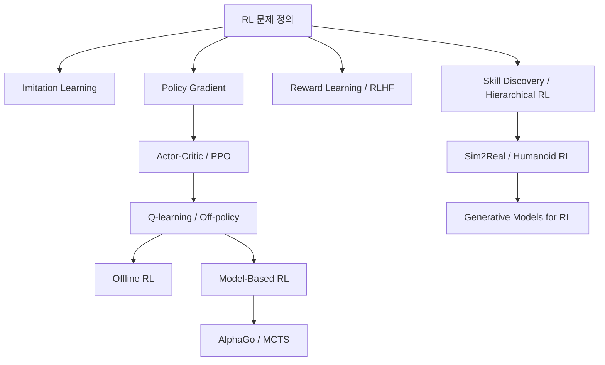

- **원본**: [GitHub — Reinforcement Learning](https://github.com/RayKim3103/Undergraduate-Course/tree/main/%5BUndergraduate%5D_Reinforcement_Learning) · 강의 노트 `01` 정리·보강
- 표준 자료(Sutton & Barto · CS285) 수준으로 다듬음. 강의 슬라이드와 대조해 사용하세요.


## 개요

강화학습(RL)은 agent가 environment와 상호작용하며 **누적 reward를 최대화하는 정책**을 배우는 문제. 정답 label 대신 행동의 결과로 돌아오는 reward·다음 state로 간접적으로 배운다.

## 1. 구성요소

| | 의미 |
|---|---|
| agent | 행동을 선택하는 학습 주체 |
| environment | 행동 결과를 만드는 외부 세계 |
| state $$s$$ | 현재 상황 정보 |
| action $$a$$ | 제어 입력 |
| reward $$r$$ | 행동 결과 피드백 |
| policy $$\pi(a\mid s)$$ | state → action 규칙 |

$$
s_0, a_0, r_0, s_1, a_1, r_1, \dots \quad(\text{순차 의사결정})
$$
한 행동이 다음 state와 이후 보상에 영향 → 단기 보상만 보면 전체 성능이 나빠진다.

## 2. 지도학습과의 차이

지도학습: $$y$$가 주어지고 $$x\to y$$ 학습. RL: 특정 state에서 어떤 action이 정답인지 바로 알 수 없다.

- data가 **i.i.d.가 아님** — agent의 policy가 수집되는 data 분포를 바꾼다.
- reward가 **sparse / delayed**일 수 있다.
- **exploration**이 필요.
- **credit assignment**: 현재 행동의 책임을 미래 reward에 배분해야.

## 3. 왜 어려운가 (deep RL의 trick 의존)

noisy policy gradient · bootstrapping 불안정 · distribution shift · value overestimation · exploration 실패 · importance sampling variance · long-horizon credit assignment.

## 4. 과목 흐름

## 5. 강의 노트 ↔ 프로그래밍 과제

| 강의 노트 | 대응 과제 |
|---|---|
| 02 모방학습 | [과제 1 — BC · DAgger](hw1-imitation-learning.md) |
| 03 정책 그래디언트·Actor-Critic | [과제 2 — REINFORCE·GAE·PPO](hw2-policy-gradients.md) |
| 04 Q-learning·Off-policy | [과제 3 — DQN·Double DQN](hw3-q-learning.md) · [과제 4 — SAC](hw4-soft-actor-critic.md) |
| 06 Offline RL | [과제 5 — CQL](hw5-offline-rl.md) |
| 07 Model-Based RL | [과제 6 — MPC·CEM](hw6-model-based-rl.md) |
| 09 Reward Learning·RLHF | [과제 7 — 선호 학습](hw7-rlhf.md) |

## 복습 질문

- MDP 구성요소와, RL data가 i.i.d.가 아닌 이유는?
- 지도학습 대비 RL의 네 가지 핵심 어려움(non-i.i.d., sparse/delayed reward, exploration, credit assignment)을 설명하라.
- deep RL이 의존하는 대표적 불안정 요인은?


---

다음: [02. 모방학습](02-imitation-learning.md)
