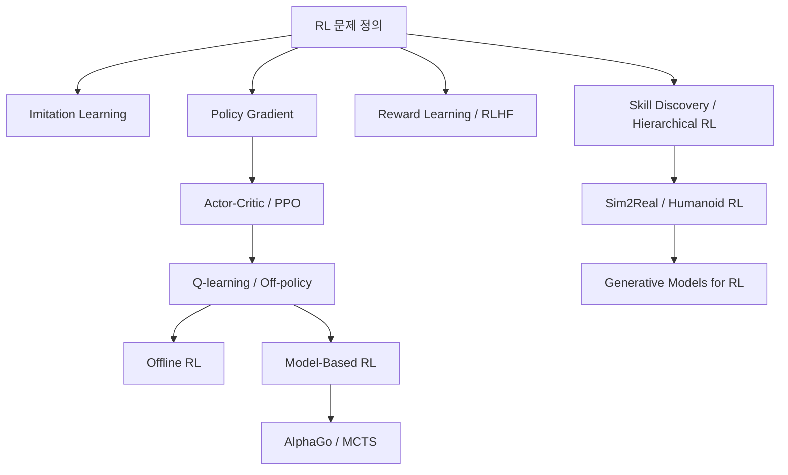

- **원본 노트**: [GitHub](https://github.com/RayKim3103/Undergraduate-Course/blob/main/%5BUndergraduate%5D_Reinforcement_Learning/lecture_notes/01%20%EA%B0%95%ED%99%94%ED%95%99%EC%8A%B5%20%EA%B0%9C%EC%9A%94.md)


## 핵심 요약

강화학습은 agent가 environment와 상호작용하면서 누적 reward를 최대화하는 행동 정책을 배우는 문제이다. 지도학습처럼 정답 label을 직접 받는 것이 아니라, 행동의 결과로 돌아오는 reward와 다음 state를 통해 무엇이 좋은 행동인지 간접적으로 배운다. 이 과목은 imitation learning, model-free RL, model-based RL, offline RL, reward learning, skill discovery, hierarchical RL, sim2real, humanoid control, generative model 기반 RL을 폭넓게 다룬다.

## 강화학습 문제

기본 구성요소는 다음과 같다.

| 구성요소 | 의미 |
| --- | --- |
| agent | 행동을 선택하는 학습 주체 |
| environment | 행동의 결과를 만들어내는 외부 세계 |
| state `s` | 현재 상황 정보 |
| action `a` | agent가 선택하는 제어 입력 |
| reward `r` | 행동 결과에 대한 피드백 |
| policy `π(a|s)` | state에서 action을 선택하는 규칙 |

강화학습은 순차 의사결정 문제이다.

```text
s0, a0, r0, s1, a1, r1, ...
```

한 번의 행동이 다음 state와 이후 가능한 보상에 영향을 주기 때문에, 단기 보상만 보고 행동하면 전체 성능이 나빠질 수 있다.

## 이 과목의 범위

강의는 모든 RL 세부 분야를 다루기보다 핵심 개념과 deep RL 구현, robotics와 control 응용, 고급 주제를 연결하는 데 초점을 둔다.

- imitation learning
- policy gradient
- actor-critic과 PPO
- Q-learning과 off-policy RL
- RL benchmark와 평가 방법
- offline RL
- model-based RL과 AlphaGo
- reward learning과 RLHF
- skill discovery와 hierarchical RL
- sim2real transfer와 humanoid RL
- generative model 및 representation learning for RL

## 지도학습과의 차이

지도학습은 정답 `y`가 주어지고 `x -> y` mapping을 학습한다. 강화학습은 특정 state에서 어떤 action이 정답인지 바로 알기 어렵다. 행동을 수행한 뒤 reward를 보고, 그 reward도 즉시 나오지 않을 수 있다.

핵심 차이는 다음과 같다.

- data가 i.i.d.가 아니다.
- agent의 policy가 수집되는 data distribution을 바꾼다.
- reward가 sparse하거나 delayed일 수 있다.
- exploration이 필요하다.
- 현재 행동의 책임을 미래 reward에 어떻게 배분할지 credit assignment가 필요하다.

## 왜 어려운가

강화학습은 재미있지만 구현과 실험이 어렵다. 강의는 특히 deep RL이 많은 trick에 의존한다는 점을 강조한다.

- noisy policy gradient
- bootstrapping으로 인한 불안정성
- distribution shift
- value overestimation
- exploration 실패
- importance sampling variance
- long-horizon credit assignment

## 응용 영역

강화학습은 게임, 로보틱스, 언어모델 정렬, 교육, chip design 등 다양한 영역에 쓰인다. 특히 로봇 제어에서는 simulation에서 많은 trial을 수행하고, real world에서는 안전하고 sample-efficient하게 배운 정책을 transfer하는 것이 중요하다.

## 과목을 읽는 순서



## 연결 노트

- [모방학습](02-imitation-learning.md)
- [정책 그래디언트 기초](03-policy-gradient-basics.md)
- [Q-learning](05-q-learning.md)
- [강화학습 리뷰와 열린 문제](18-rl-review-and-open-problems.md)

## 보강 학습 노트

### 큰 그림

- 이 문서는 **01. 강화학습 개요**를 다루며, agent가 environment와 상호작용하며 reward를 최대화하는 정책을 배우는 문제를 MDP, value, policy, exploration으로 해석한다.
- 단편적인 정의를 외우기보다 입력이 무엇이고, 내부에서 어떤 변환이 일어나며, 출력이나 성능 지표가 어떻게 결정되는지 흐름으로 잡는 것이 좋다.
- 앞뒤 단원과 연결해 보면 이 주제가 왜 필요한지, 어떤 가정을 추가하거나 완화하는지 더 분명해진다.

### 핵심을 더 깊게 보기

- value-based, policy-gradient, actor-critic 방법은 Bellman 관점과 trajectory likelihood 관점의 조합이다.
- on-policy와 off-policy의 차이는 sample을 모으는 policy와 학습하려는 policy가 같은지에서 출발한다.
- reward 설계, exploration, distribution shift가 성능과 안정성을 좌우하므로 실험 해석이 조심스럽다.

### 문제 풀이 또는 구현 루틴

- state, action, transition, reward, horizon, discount로 문제를 먼저 쪼갠다.
- 업데이트 식에서는 target, bootstrap 여부, importance sampling 여부를 표시한다.
- benchmark 결과는 평균 return뿐 아니라 variance, sample efficiency, seed sensitivity를 함께 본다.
- 마지막에는 단위, 차원, boundary condition, edge case를 확인해 계산 결과가 현실적인지 검산한다.

### 자주 하는 실수

- 높은 training return이 robust policy를 의미하지 않을 수 있다.
- discount factor는 장기 보상과 variance를 조절하는 설계 선택이다.
- offline RL에서는 dataset 밖 action을 과신하면 extrapolation error가 커진다.
- 정의를 그대로 적용하기 전에 이 단원에서 전제한 ideal assumption이 실제 문제에서도 유지되는지 확인한다.

### 스스로 점검할 질문

- 이 알고리즘은 어디에서 bias를 넣고 어디에서 variance를 줄이는가?
- 환경과 reward가 조금 바뀌면 policy가 어떻게 무너질 수 있는가?
- 탐험을 늘리는 선택이 sample efficiency와 안정성에 어떤 비용을 만드는가?
- **01. 강화학습 개요**를 한 문장으로 설명하고, 관련 수식이나 회로/알고리즘/시스템 그림 없이도 핵심 흐름을 말할 수 있는가?



---

다음: [02. 모방학습](02-imitation-learning.md)
