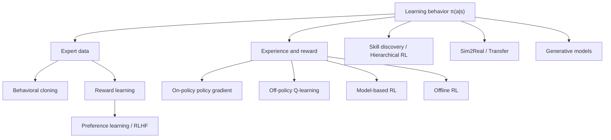

- **원본**: [GitHub — Reinforcement Learning](https://github.com/RayKim3103/Undergraduate-Course/tree/main/%5BUndergraduate%5D_Reinforcement_Learning) · 강의 노트 `18` 정리·보강
- 강의 전체를 묶는 리뷰. 막히면 해당 노트로 들어가 복습.


## 전체 문제 정의

$$
\max_\pi\; \mathbb{E}_{\tau\sim\pi}\Big[\sum_t r_t\Big],\qquad \pi(a\mid s)
$$
data가 **i.i.d.가 아님** — agent의 action이 다음 state와 이후 data 분포를 바꾼다. 이것이 RL을 supervised learning보다 훨씬 불안정하게 만든다.

## 해법 지도

## 반복 주제 1 — Distribution Shift

| 주제 | 어디서 나타나는가 |
|---|---|
| imitation learning | expert state 분포 ≠ learner rollout 분포 |
| off-policy RL | replay buffer 분포 ≠ 현재 policy 분포 |
| offline RL | dataset support 밖 action의 value 불확실 |
| sim2real | simulation 분포 ≠ real world 분포 |
| generative RL | offline data 밖 trajectory 생성 어려움 |

효율적 RL = **distribution shift를 어떻게 제어하느냐**의 문제.

## 반복 주제 2 — Human Supervision의 한계

모든 task reward를 사람이 설계 불가 → imitation learning / reward learning / RLHF / skill discovery / generative model(행동 prior).

## 반복 주제 3 — Sample Inefficiency

off-policy replay(재사용) / model-based(imaginary rollout) / offline RL(기존 dataset) / transfer·sim2real / hierarchical RL(long-horizon exploration 축소) / representation learning(observation complexity 축소).

## 열린 문제

- 안전하고 신뢰 가능한 real-world exploration
- sparse reward·long-horizon credit assignment
- offline dataset 밖 행동의 평가·일반화
- reward hacking을 막는 reward learning
- sim2real gap을 체계적으로 줄이기
- humanoid·dexterous manipulation의 안정적 학습
- foundation model과 RL의 결합
- benchmark 성능이 실제 문제 해결로 이어지는지 검증

## 마무리 자기 점검

- MDP 구성요소를 설명할 수 있는가?
- policy gradient와 Q-learning의 차이는?
- PPO가 왜 clipping을 쓰는가?
- offline RL이 일반 off-policy RL보다 어려운 이유는?
- model-based RL에서 model error가 왜 위험한가?
- reward learning과 RLHF의 절차를 연결할 수 있는가?
- skill discovery·hierarchical RL이 long-horizon 문제를 어떻게 줄이는가?
- sim2real gap의 원인과 대응책은?


---

이전: [12. 생성모델·표현학습 기반 RL](12-generative-models-and-representation-rl.md)
