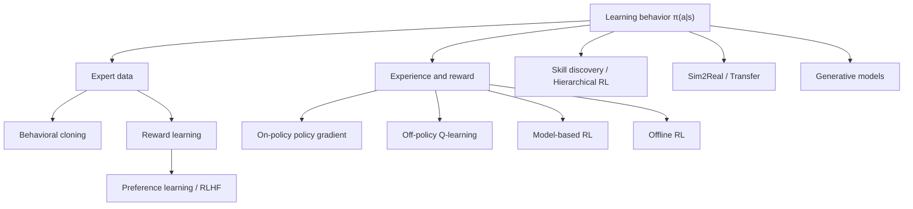

- **원본 노트**: [GitHub](https://github.com/RayKim3103/Undergraduate-Course/blob/main/%5BUndergraduate%5D_Reinforcement_Learning/lecture_notes/18%20%EA%B0%95%ED%99%94%ED%95%99%EC%8A%B5%20%EB%A6%AC%EB%B7%B0%EC%99%80%20%EC%97%B4%EB%A6%B0%20%EB%AC%B8%EC%A0%9C.md)


## 핵심 요약

마지막 강의는 강화학습의 전체 흐름을 다시 묶고, 반복해서 등장한 어려움과 열린 문제를 정리한다. 핵심은 RL이 경험과 간접 feedback에서 행동을 배우는 문제이며, action이 미래 observation distribution 자체를 바꾸기 때문에 supervised learning보다 훨씬 불안정하다는 점이다.

## 전체 문제 정의

강화학습은 다음 목적을 가진다.

```text
maximize Eτ~π [Σt rt]
```

policy는 state에서 action을 선택한다.

```text
π(a|s)
```

그러나 data는 i.i.d.가 아니다. agent가 어떤 action을 선택하느냐가 다음 state와 이후 data distribution을 바꾼다.

## 핵심 해법 지도



## 반복 주제 1: Distribution Shift

distribution shift는 거의 모든 주제에서 반복된다.

- imitation learning: expert state distribution과 learner rollout distribution이 다름
- off-policy RL: replay buffer와 현재 policy distribution이 다름
- offline RL: dataset support 밖 action에 대한 value가 불확실함
- sim2real: simulation distribution과 real world distribution이 다름
- generative RL: offline data 밖 trajectory 생성이 어려움

효율적인 RL은 결국 distribution shift를 어떻게 제어하느냐의 문제로 볼 수 있다.

## 반복 주제 2: Human Supervision의 한계

모든 task reward를 사람이 설계할 수 없다. 그래서 다음 접근들이 등장한다.

- imitation learning: expert action을 supervision으로 사용
- reward learning: demonstration이나 preference에서 reward를 학습
- RLHF: human feedback으로 reward model 또는 policy를 정렬
- skill discovery: reward 없이 행동 repertoire를 학습
- generative model: 큰 data에서 행동 prior를 학습

## 반복 주제 3: Sample Inefficiency

RL은 많은 trial을 필요로 한다. 이를 줄이기 위한 접근은 다음과 같다.

- off-policy replay로 data reuse
- model-based RL로 imaginary rollout 생성
- offline RL로 기존 dataset 재사용
- transfer와 sim2real로 simulation 경험 활용
- hierarchical RL로 long-horizon exploration 축소
- representation learning으로 observation complexity 축소

## 열린 문제

강화학습의 주요 열린 문제는 다음과 같다.

- 안전하고 신뢰 가능한 real-world exploration
- sparse reward와 long-horizon credit assignment
- offline dataset 밖 행동의 평가와 일반화
- reward hacking을 막는 reward learning
- sim2real gap을 체계적으로 줄이는 방법
- humanoid와 dexterous manipulation의 안정적 학습
- foundation model과 RL의 결합 방식
- benchmark 성능이 실제 문제 해결로 이어지는지 검증

## 응용 분야

강의는 RL 응용으로 robotics, language models, education, chip design 등을 언급한다. 공통점은 단일 예측보다 순차적 decision making이 중요하고, 행동이 미래 상태를 바꾸며, 장기적 목표를 최적화해야 한다는 것이다.

## 학습 마무리 체크

- MDP의 구성요소를 설명할 수 있는가?
- policy gradient와 Q-learning의 차이를 말할 수 있는가?
- PPO가 왜 clipping을 쓰는지 설명할 수 있는가?
- offline RL이 일반 off-policy RL보다 어려운 이유를 말할 수 있는가?
- model-based RL에서 model error가 왜 위험한지 설명할 수 있는가?
- reward learning과 RLHF의 절차를 연결할 수 있는가?
- skill discovery와 hierarchical RL이 long-horizon 문제를 어떻게 줄이는지 말할 수 있는가?
- sim2real gap의 원인과 대응책을 말할 수 있는가?

## 연결 노트

- [강화학습 개요](01-rl-overview.md)
- [모방학습](02-imitation-learning.md)
- [Offline RL](08-offline-rl.md)
- [Reward Learning](12-reward-learning.md)
- [Hierarchical RL](14-hierarchical-rl.md)
- [Sim2Real Transfer](15-sim2real-transfer.md)
- [생성모델과 표현학습 기반 RL](17-generative-models-and-representation-learning-rl.md)



---

이전: [17. 생성모델과 표현학습 기반 RL](17-generative-models-and-representation-learning-rl.md)
