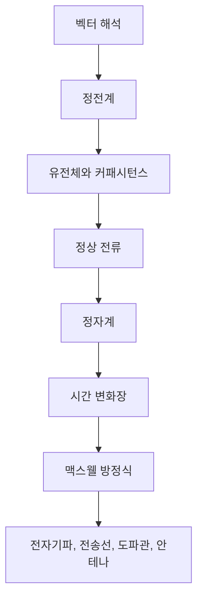

- **원본 노트**: [GitHub](https://github.com/RayKim3103/Undergraduate-Course/blob/main/%5BUndergraduate%5D_Electromagnetics/lecture_notes/00%20%EA%B0%95%EC%9D%98%20%EA%B0%9C%EC%9A%94%EC%99%80%20%EC%A0%84%EC%9E%90%EA%B8%B0%ED%95%99%20%EC%A7%80%EB%8F%84.md)


## 핵심 요약

전자기학은 전하, 전류, 전기장, 자기장, 물질, 시간 변화가 서로 어떻게 연결되는지 설명하는 장 이론이다. 고등학교나 일반물리에서 배운 쿨롱 법칙, 옴의 법칙, 앙페르 법칙, 패러데이 법칙을 개별 공식으로 외우는 수준에서 멈추지 않고, 이 강의에서는 이를 미분방정식과 적분 법칙으로 일반화한다. 최종 목표는 **맥스웰 방정식**이 거시적 전자기 현상을 매우 짧은 수학적 언어로 통합한다는 점을 이해하는 것이다.

## 강의가 던지는 큰 질문

- 빛은 무엇인가?
- 옴의 법칙 $$V=IR$$ 은 미시적으로 왜 성립하는가?
- 전하가 정지해 있을 때와 움직일 때 장은 어떻게 달라지는가?
- 전기장과 자기장은 각각 어떤 source에서 만들어지는가?
- 시간에 따라 변하는 자기장이 왜 전기장을 만들고, 시간에 따라 변하는 전기장이 왜 자기장을 만드는가?
- 회로 이론, 통신, 안테나, 반도체, 전력기기, 센서, MRI 같은 공학 시스템을 같은 전자기 법칙으로 설명할 수 있는가?

## 전체 흐름

## 수학적 언어

전자기학의 법칙은 위치와 시간에 따라 변하는 장을 다루므로 미분방정식으로 표현된다. 뉴턴 법칙 $$F=ma$$ 가 운동의 시간 변화를 설명하는 미분방정식인 것처럼, 맥스웰 방정식은 전자기장의 공간 변화와 시간 변화를 설명한다.

이 강의에서 특히 중요한 연산자는 $$\nabla$$ 이다.

| 연산자 | 의미 |
|---|---|
| $$\nabla V$$ | 스칼라장의 gradient — 가장 빠르게 증가하는 방향과 증가율 |
| $$\nabla \cdot \mathbf{A}$$ | 벡터장의 divergence — source 또는 sink의 정도 |
| $$\nabla \times \mathbf{A}$$ | 벡터장의 curl — 순환 또는 소용돌이 성분 |
| $$\nabla^2 V$$ | Laplacian — 포아송 방정식과 라플라스 방정식의 핵심 연산자 |

## 강의 운영과 평가 포인트

강의는 전자기 현상을 물리적으로 해석하고, 이를 수학 문제로 바꾸어 푸는 데 초점을 둔다. 장별 시험이 여러 번 있으며, 학생 발표 주제로는 전기장 응용, 메타물질, 초전도체, 와전류, 자기부상열차 등이 제시된다.

평가 항목은 장별 시험, 학생 발표, QA 참여가 중심이다. 단순 암기보다 특정 대칭 구조에서 어떤 법칙을 선택해야 하는지, 적분면과 경로를 어떻게 잡아야 하는지가 중요하다.

## 학습 관점

전자기학을 공부할 때는 먼저 **source**를 확인한다.

| source | 봐야 할 장 |
|---|---|
| 정전하 | $$\mathbf{E}, \mathbf{D}, V$$ |
| 정상 전류 | $$\mathbf{J}, \mathbf{B}, \mathbf{H}, \mathbf{A}$$ |
| 시간 변화 | $$\partial\mathbf{B}/\partial t$$, $$\partial\mathbf{D}/\partial t$$, 유도 전기장, 변위 전류 |
| 물질 | $$\varepsilon, \mu, \sigma, \mathbf{P}, \mathbf{M}$$ 과 경계조건 |

이 네 갈래가 각각 [벡터 대수와 좌표계](01-vector-algebra-and-coordinates.md)→[벡터 미적분](02-vector-calculus-and-field-theory.md)의 언어 위에서 [정전계](03-electrostatics-1-coulomb-and-gauss.md)→[유전체](04-electrostatics-2-dielectrics-and-capacitance.md)→[정상 전류](05-steady-current-and-resistance.md)→[정자계](06-magnetostatics-1-biot-savart-and-ampere.md)→[자성체](07-magnetostatics-2-materials-and-boundary-conditions.md)→[시간 변화장](08-time-varying-fields-and-maxwell.md)으로 확장되며 이 강의의 목차 그대로를 이룬다.

## 연결 노트

- [벡터 대수와 직교 좌표계](01-vector-algebra-and-coordinates.md)
- [벡터 미적분과 장 이론](02-vector-calculus-and-field-theory.md)
- [정전계 I - 쿨롱 법칙과 가우스 법칙](03-electrostatics-1-coulomb-and-gauss.md)
- [시간 변화장과 맥스웰 방정식](08-time-varying-fields-and-maxwell.md)



---

다음: [01. 벡터 대수와 직교 좌표계](01-vector-algebra-and-coordinates.md)
