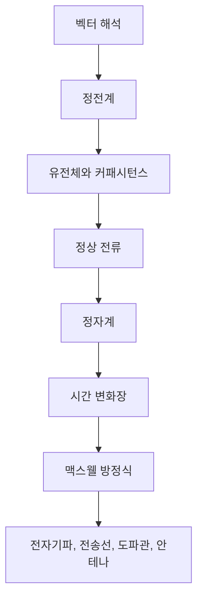

- **원본 노트**: [GitHub](https://github.com/RayKim3103/Undergraduate-Course/blob/main/%5BUndergraduate%5D_Electromagnetics/lecture_notes/00%20%EA%B0%95%EC%9D%98%20%EA%B0%9C%EC%9A%94%EC%99%80%20%EC%A0%84%EC%9E%90%EA%B8%B0%ED%95%99%20%EC%A7%80%EB%8F%84.md)


## 핵심 요약

전자기학은 전하, 전류, 전기장, 자기장, 물질, 시간 변화가 서로 어떻게 연결되는지 설명하는 장 이론이다. 고등학교나 일반물리에서 배운 쿨롱 법칙, 옴의 법칙, 앙페르 법칙, 패러데이 법칙을 개별 공식으로 외우는 수준에서 멈추지 않고, 이 강의에서는 이를 미분방정식과 적분 법칙으로 일반화한다. 최종 목표는 맥스웰 방정식이 거시적 전자기 현상을 매우 짧은 수학적 언어로 통합한다는 점을 이해하는 것이다.

## 강의가 던지는 큰 질문

- 빛은 무엇인가?
- 옴의 법칙 `V = IR`은 미시적으로 왜 성립하는가?
- 전하가 정지해 있을 때와 움직일 때 장은 어떻게 달라지는가?
- 전기장과 자기장은 각각 어떤 source에서 만들어지는가?
- 시간에 따라 변하는 자기장이 왜 전기장을 만들고, 시간에 따라 변하는 전기장이 왜 자기장을 만드는가?
- 회로 이론, 통신, 안테나, 반도체, 전력기기, 센서, MRI 같은 공학 시스템을 같은 전자기 법칙으로 설명할 수 있는가?

## 전체 흐름

## 수학적 언어

전자기학의 법칙은 위치와 시간에 따라 변하는 장을 다루므로 미분방정식으로 표현된다. 뉴턴 법칙 `F = ma`가 운동의 시간 변화를 설명하는 미분방정식인 것처럼, 맥스웰 방정식은 전자기장의 공간 변화와 시간 변화를 설명한다.

이 강의에서 특히 중요한 연산자는 `∇`이다.

- `∇V`: 스칼라장의 기울기, 즉 가장 빠르게 증가하는 방향과 증가율
- `∇ · A`: 벡터장의 발산, 즉 source 또는 sink의 정도
- `∇ × A`: 벡터장의 회전, 즉 순환 또는 소용돌이 성분
- `∇²V`: 라플라시안, 포아송 방정식과 라플라스 방정식의 핵심 연산자

## 강의 운영과 평가 포인트

강의는 전자기 현상을 물리적으로 해석하고, 이를 수학 문제로 바꾸어 푸는 데 초점을 둔다. 장별 시험이 여러 번 있으며, 학생 발표 주제로는 전기장 응용, 메타물질, 초전도체, 와전류, 자기부상열차 등이 제시된다.

평가 항목은 장별 시험, 학생 발표, QA 참여가 중심이다. 단순 암기보다 특정 대칭 구조에서 어떤 법칙을 선택해야 하는지, 적분면과 경로를 어떻게 잡아야 하는지가 중요하다.

## 학습 관점

전자기학을 공부할 때는 먼저 source를 확인한다.

- 정전하가 source이면 `E`, `D`, `V`를 본다.
- 정상 전류가 source이면 `J`, `B`, `H`, `A`를 본다.
- 시간 변화가 있으면 `∂B/∂t`, `∂D/∂t`, 유도 전기장, 변위 전류를 함께 본다.
- 물질이 있으면 `ε`, `μ`, `σ`, `P`, `M`과 경계조건이 추가된다.

## 연결 노트

- [벡터 대수와 직교 좌표계](01-vector-algebra-and-coordinates.md)
- [벡터 미적분과 장 이론](03-vector-calculus-and-field-theory.md)
- [정전계 I - 쿨롱 법칙과 가우스 법칙](04-electrostatics-1-coulomb-and-gauss.md)
- [시간 변화장과 맥스웰 방정식](09-time-varying-fields-and-maxwell.md)

## 보강 학습 노트

### 큰 그림

- 이 문서는 **00. 강의 개요와 전자기학 지도**를 다루며, 벡터해석을 바탕으로 전기장, 자기장, 물질 경계조건, Maxwell 방정식을 연결해 전자기 현상을 설명한다.
- 단편적인 정의를 외우기보다 입력이 무엇이고, 내부에서 어떤 변환이 일어나며, 출력이나 성능 지표가 어떻게 결정되는지 흐름으로 잡는 것이 좋다.
- 앞뒤 단원과 연결해 보면 이 주제가 왜 필요한지, 어떤 가정을 추가하거나 완화하는지 더 분명해진다.

### 핵심을 더 깊게 보기

- 전자기학은 field의 미분형/적분형 표현을 상황에 맞게 바꾸는 능력이 핵심이다.
- 대칭성이 강한 문제는 Coulomb/Biot-Savart 적분보다 Gauss/Ampere 법칙이 훨씬 간단하다.
- 경계조건은 Maxwell 방정식을 작은 pillbox/loop에 적용한 결과이며 물질 상수가 field 분포를 바꾼다.

### 문제 풀이 또는 구현 루틴

- 좌표계를 먼저 고르고 대칭성으로 field 방향과 변수 의존성을 줄인다.
- 미분형과 적분형 중 어떤 형태가 더 쉬운지 판단한 뒤 법칙을 적용한다.
- 경계에서는 normal/tangential component를 나누고 free charge/current 존재 여부를 표시한다.
- 마지막에는 단위, 차원, boundary condition, edge case를 확인해 계산 결과가 현실적인지 검산한다.

### 자주 하는 실수

- 벡터 방향을 scalar 크기처럼 계산하면 부호와 성분이 쉽게 틀린다.
- 전위와 전기장은 음의 gradient 관계이므로 증가 방향을 혼동하지 않는다.
- 시간 변화장이 있으면 electrostatics/magnetostatics에서 쓰던 보존장 가정이 깨질 수 있다.
- 정의를 그대로 적용하기 전에 이 단원에서 전제한 ideal assumption이 실제 문제에서도 유지되는지 확인한다.

### 스스로 점검할 질문

- 이 문제의 대칭성은 어떤 좌표계에서 가장 단순한가?
- source가 charge인지 current인지, free인지 bound인지 구분했는가?
- field, flux density, potential 중 무엇을 먼저 구하면 나머지가 쉬운가?
- **00. 강의 개요와 전자기학 지도**를 한 문장으로 설명하고, 관련 수식이나 회로/알고리즘/시스템 그림 없이도 핵심 흐름을 말할 수 있는가?



---

다음: [01. 벡터 대수와 직교 좌표계](01-vector-algebra-and-coordinates.md)
