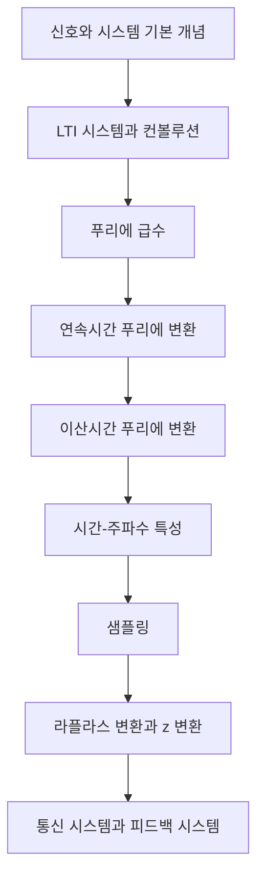

- **원본 노트**: [GitHub](https://github.com/RayKim3103/Undergraduate-Course/blob/main/%5BUndergraduate%5D_Signals_and_Systems/lecture_notes/01%20%EC%8B%A0%ED%98%B8%EC%99%80%20%EC%8B%9C%EC%8A%A4%ED%85%9C%20%EA%B0%9C%EC%9A%94.md)


## 핵심 요약

신호와 시스템 과목은 연속시간 신호 `x(t)`와 이산시간 신호 `x[n]`를 수학적으로 표현하고, 시스템이 입력 신호를 출력 신호로 바꾸는 방식을 분석하는 과목이다. 오디오, 음성, 영상, 통신, 레이더, 생체신호, 머신러닝까지 다양한 응용이 같은 신호 처리 언어로 설명된다. 이 장은 신호의 기본 분류, 독립변수 변환, 기본 신호, 시스템 성질을 정리한다.

## 전체 과목 지도



## 신호 처리 응용

강의는 신호 처리의 동기를 여러 실제 예로 시작한다.

- 오디오: 압축, 그래픽 이퀄라이저, 잔향, 3D 오디오, 보청기
- 음성: 음성 인식, 화자 인식, 감정 인식, 음성 합성, 잡음 제거
- 영상: JPEG, MPEG, 노이즈 제거, 색상 양자화, 얼굴 검출, 객체 분할
- 통신: 적응형 에코 제거, 빔포밍, 표적 검출
- 생체신호: ECG, EEG, 심박수 추정, 간섭 제거
- 지진 신호와 머신러닝: 입력 신호에서 feature나 class를 추정

공통 관점은 입력 신호를 분석하고, 필요한 성분만 남기거나 변환해 원하는 출력 신호를 만드는 것이다.

## CT 신호와 DT 신호

| 구분 | 표기 | 의미 |
| --- | --- | --- |
| 연속시간 신호 | `x(t)` | 독립변수 `t`가 연속값 |
| 이산시간 신호 | `x[n]` | 독립변수 `n`이 정수 |

샘플링은 CT 신호에서 일정 간격의 값을 뽑아 DT 신호를 만드는 과정이다.

## 에너지와 전력

CT 신호의 총 에너지와 평균 전력은 다음과 같이 정의한다.

```text
E = ∫ |x(t)|^2 dt
P = lim(T -> ∞) (1 / 2T) ∫[-T,T] |x(t)|^2 dt
```

DT 신호에서는 합으로 바뀐다.

```text
E = Σ |x[n]|^2
P = lim(N -> ∞) (1 / (2N + 1)) Σ[n=-N,N] |x[n]|^2
```

분류는 다음처럼 한다.

- 에너지 신호: `0 < E < ∞`, 평균 전력은 0
- 전력 신호: `0 < P < ∞`, 총 에너지는 무한대
- 둘 다 아닌 신호: 에너지와 전력이 모두 유한한 의미를 갖지 않음

유한 길이 펄스는 에너지 신호이고, 주기 신호와 정현파는 전력 신호이다.

## 독립변수 변환

신호를 해석할 때 시간 이동, 반전, 스케일링을 자주 사용한다.

| 변환 | CT | DT | 해석 |
| --- | --- | --- | --- |
| 시간 이동 | `x(t - t0)` | `x[n - n0]` | 오른쪽으로 지연 |
| 시간 반전 | `x(-t)` | `x[-n]` | 시간축 기준 반사 |
| 시간 스케일링 | `x(at)` | 제한적 | `a > 1`이면 압축 |
| 일반 변환 | `x(at + b)` | `x[an + b]` | 순서 해석 주의 |

복합 변환은 괄호 안을 먼저 해석한다. 보통 시간축에서 기준점을 찾고, 스케일링과 이동 순서를 명확히 잡는 것이 중요하다.

## 주기 신호

CT 신호는 어떤 `T > 0`에 대해

```text
x(t + T) = x(t)
```

이면 주기 신호이다. 가장 작은 양의 `T`가 기본주기 `T0`이다.

DT 신호는 어떤 양의 정수 `N`에 대해

```text
x[n + N] = x[n]
```

이면 주기 신호이다. DT에서는 주기가 반드시 정수여야 하므로 CT보다 조건이 더 까다롭다.

## 짝신호와 홀신호

짝신호와 홀신호는 대칭성으로 정의한다.

```text
even: x(t) = x(-t), x[n] = x[-n]
odd:  x(t) = -x(-t), x[n] = -x[-n]
```

임의의 신호는 짝성분과 홀성분으로 분해된다.

```text
xe(t) = (1/2)[x(t) + x(-t)]
xo(t) = (1/2)[x(t) - x(-t)]
```

## 복소 지수와 정현파

Euler 관계식은 신호와 시스템에서 가장 중요한 표현 중 하나이다.

```text
ejθ = cosθ + j sinθ
cosθ = (ejθ + e-jθ) / 2
sinθ = (ejθ - e-jθ) / 2j
```

CT 복소 지수 `ejω0t`는 모든 `ω0`에 대해 주기적이며 기본주기는 `T0 = 2π/ω0`이다. DT 복소 지수 `ejΩ0n`은 `Ω0 / 2π`가 유리수일 때만 주기적이다. 또한 DT 주파수는 `2π` 간격으로 같은 신호를 만든다.

```text
ej(Ω0 + 2π)n = ejΩ0n
```

따라서 DT에서는 길이 `2π`의 주파수 구간만 보면 충분하다.

## 단위 임펄스와 단위 계단

DT 단위 임펄스는

```text
δ[n] = 1, n = 0
δ[n] = 0, n ≠ 0
```

이고 sifting property를 가진다.

```text
x[n]δ[n - n0] = x[n0]δ[n - n0]
```

DT 단위 계단과 임펄스의 관계는 다음과 같다.

```text
δ[n] = u[n] - u[n - 1]
u[n] = Σ[k=-∞,n] δ[k]
```

CT에서도 단위 임펄스 `δ(t)`는 적분에서 값을 뽑는 이상화 함수로 사용한다.

```text
∫ x(t)δ(t - t0) dt = x(t0)
```

## 시스템의 기본 성질

시스템은 입력 신호를 출력 신호로 바꾸는 관계이다.

```text
CT: x(t) -> y(t)
DT: x[n] -> y[n]
```

### Memory

memoryless 시스템은 현재 출력이 현재 입력에만 의존한다. 지연, 누산기, 적분기는 과거 값에 의존하므로 memory가 있다.

### Invertibility

서로 다른 입력이 항상 서로 다른 출력으로 가면 invertible이다. 제곱 시스템처럼 부호 정보가 사라지는 경우는 inverse가 존재하지 않는다.

### Causality

causal 시스템은 현재 출력이 현재와 과거 입력에만 의존한다. 미래 입력 `x(t + 1)`이나 `x[n + 1]`에 의존하면 noncausal이다.

### Stability

BIBO 안정성은 bounded input이 항상 bounded output을 만든다는 조건이다.

### Time invariance

입력을 시간 이동하면 출력도 같은 만큼 시간 이동해야 한다.

```text
x(t) -> y(t) 이면 x(t - t0) -> y(t - t0)
```

### Linearity

선형 시스템은 superposition을 만족한다.

```text
a x1 + b x2 -> a y1 + b y2
```

LTI 시스템은 linearity와 time invariance를 모두 만족하는 시스템이다. 이후 장에서 LTI 시스템은 impulse response와 convolution으로 완전히 표현된다.

## 연결 노트

- [LTI 시스템과 컨볼루션](02-lti-systems-and-convolution.md)
- [푸리에 급수](03-fourier-series.md)

## 보강 학습 노트

### 큰 그림

- 이 문서는 **01. 신호와 시스템 개요**를 다루며, 신호와 LTI 시스템을 convolution, Fourier/Laplace/z 변환으로 해석하는 공학 수학의 핵심 기반이다.
- 단편적인 정의를 외우기보다 입력이 무엇이고, 내부에서 어떤 변환이 일어나며, 출력이나 성능 지표가 어떻게 결정되는지 흐름으로 잡는 것이 좋다.
- 앞뒤 단원과 연결해 보면 이 주제가 왜 필요한지, 어떤 가정을 추가하거나 완화하는지 더 분명해진다.

### 핵심을 더 깊게 보기

- LTI 시스템은 impulse response만 알면 convolution으로 모든 입력에 대한 출력을 구할 수 있다.
- Fourier 계열과 변환은 신호를 frequency component로 분해해 filtering과 system response를 단순화한다.
- Laplace/z transform은 Fourier보다 ROC와 pole 관점을 추가해 stability와 transient까지 다룬다.

### 문제 풀이 또는 구현 루틴

- 신호를 continuous/discrete, periodic/aperiodic, energy/power로 먼저 분류한다.
- LTI 문제는 impulse response, convolution, frequency response 중 가장 쉬운 표현을 선택한다.
- 변환 문제에서는 transform pair, property, ROC 또는 convergence 조건을 함께 기록한다.
- 마지막에는 단위, 차원, boundary condition, edge case를 확인해 계산 결과가 현실적인지 검산한다.

### 자주 하는 실수

- time shift와 frequency shift property의 부호를 자주 혼동한다.
- sampling은 spectrum replication을 만들므로 Nyquist 조건을 항상 확인해야 한다.
- stability는 impulse response 절대적분/절대합 조건과 pole 위치 조건을 연결해 판단한다.
- 정의를 그대로 적용하기 전에 이 단원에서 전제한 ideal assumption이 실제 문제에서도 유지되는지 확인한다.

### 스스로 점검할 질문

- 이 신호/시스템은 어떤 분류에 속하는가?
- time domain과 frequency domain 중 어느 쪽 계산이 더 단순한가?
- pole, zero, ROC가 causality와 stability를 어떻게 말해 주는가?
- **01. 신호와 시스템 개요**를 한 문장으로 설명하고, 관련 수식이나 회로/알고리즘/시스템 그림 없이도 핵심 흐름을 말할 수 있는가?



---

다음: [02. LTI 시스템과 컨볼루션](02-lti-systems-and-convolution.md)
