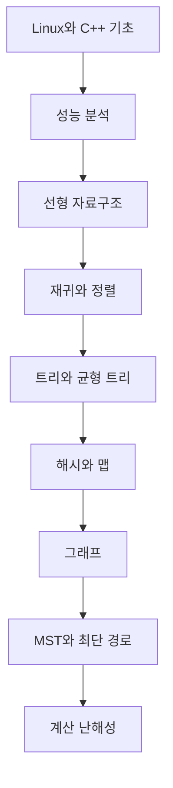

- **원본 노트**: [GitHub](https://github.com/RayKim3103/Undergraduate-Course/blob/main/%5BUndergraduate%5D_Data_Structure/lecture_notes/00%20%EA%B0%95%EC%9D%98%20%EA%B0%9C%EC%9A%94.md)


## 한눈에 보기

이 강의는 자료구조와 알고리즘을 C++와 Linux 개발 환경 위에서 배우는 과목이다. 단순히 구조를 암기하는 것이 아니라, 어떤 문제에서 어떤 자료구조를 쓰면 시간과 공간이 어떻게 달라지는지 분석하고 실제 프로그램으로 구현하는 능력을 목표로 한다.

## 강의 목표

- 알고리즘과 자료구조의 기본 개념을 이해한다.
- 배열, 벡터, 연결 리스트, 스택, 큐, 트리, 해시, 그래프 등 핵심 자료구조의 성능 특성을 비교한다.
- 문제 요구사항에 맞는 자료구조와 알고리즘을 선택하고 프로그램에 적용한다.
- 실행 시간과 메모리 사용량을 실험적, 이론적으로 계산한다.
- C++ 프로그래밍 능력, 객체지향 설계, 디버깅, 테스트, 성능 측정 도구 사용 능력을 함께 기른다.

## 왜 전기전자공학에서 프로그래밍을 배우는가

전자공학 분야에서도 신호 처리, 임베디드 시스템, 회로 설계 자동화, 통신, 제어, 머신러닝, 운영체제 수준 최적화 등 거의 모든 영역에서 프로그램이 도구이자 결과물이 된다. 좋은 하드웨어 지식만으로는 충분하지 않고, 데이터를 어떻게 저장하고 처리할지 설계하는 능력이 필요하다.

## 왜 C++인가

C++는 메모리와 성능을 세밀하게 다룰 수 있으면서도 객체지향과 템플릿 같은 추상화 도구를 제공한다. 자료구조 과목에서는 특히 다음 이유로 유용하다.

- 포인터와 동적 할당을 통해 연결 리스트, 트리, 그래프를 직접 구현할 수 있다.
- 클래스와 템플릿으로 재사용 가능한 컨테이너를 만들 수 있다.
- 표준 라이브러리의 `vector`, `string`, `iostream`을 쓰며 실제 개발 감각을 익힐 수 있다.
- 성능 분석 결과가 코드 구조와 비교적 직접 연결된다.

## 왜 Linux인가

Linux 환경은 컴파일러, 쉘, 파일 시스템, 리디렉션, 파이프, Makefile 등 개발 도구가 잘 통합되어 있다. 과제 채점도 Linux의 `g++` 기준으로 이루어지므로, 로컬에서 같은 환경으로 빌드하고 실행하는 습관이 중요하다.

## 평가와 과제 운영

| 항목 | 비중 | 핵심 |
|---|---:|---|
| 중간고사 | 20% | 이론, 구현, 복잡도 분석 |
| 기말고사 | 30% | 전 범위 자료구조와 알고리즘 |
| 프로그래밍 과제 | 40% | C++ 구현, Linux 빌드, 정확성 |
| 참여 | 10% | 수업 참여와 학습 태도 |

프로그래밍 과제는 여러 차례 출제되며, 제출 기한과 Linux/g++ 실행 가능 여부가 중요하다. 지각 제출에는 감점이 있고, 표절은 엄격하게 다루어진다.

## 과목 전체 지도

## 함께 보면 좋은 노트

- [Linux 기본](01-linux-basics.md)
- [C++ 타입](03-cpp-types.md)
- [성능 분석](09-performance-analysis.md)
- [배열과 벡터](10-arrays-and-vectors.md)
- [그래프](22-graphs.md)

## 보강 학습 노트

### 큰 그림

- 이 문서는 **00. 강의 개요**를 다루며, C++ 기초와 자료구조/알고리즘을 연결해 데이터를 저장하고 탐색하고 갱신하는 비용을 체계적으로 분석한다.
- 단편적인 정의를 외우기보다 입력이 무엇이고, 내부에서 어떤 변환이 일어나며, 출력이나 성능 지표가 어떻게 결정되는지 흐름으로 잡는 것이 좋다.
- 앞뒤 단원과 연결해 보면 이 주제가 왜 필요한지, 어떤 가정을 추가하거나 완화하는지 더 분명해진다.

### 핵심을 더 깊게 보기

- 자료구조 선택은 기능이 아니라 operation별 시간/공간 복잡도와 access pattern의 선택이다.
- C++에서는 객체 수명, copy/move, pointer/reference, const correctness가 자료구조 안정성을 좌우한다.
- 알고리즘 분석은 Big-O뿐 아니라 input size, worst/average case, hidden constant, memory locality를 함께 본다.

### 문제 풀이 또는 구현 루틴

- 필요한 operation을 insert/delete/search/traverse/update로 나눈 뒤 빈도를 추정한다.
- 구현 전 invariant를 적고, 각 함수가 invariant를 보존하는지 확인한다.
- 복잡도는 loop 중첩, recursion recurrence, data movement 비용을 분리해 계산한다.
- 마지막에는 단위, 차원, boundary condition, edge case를 확인해 계산 결과가 현실적인지 검산한다.

### 자주 하는 실수

- 포인터 소유권을 명확히 하지 않으면 leak, dangling pointer, double delete가 생긴다.
- 평균 O(1)인 hash table도 충돌과 rehash 비용을 고려해야 한다.
- 정렬/그래프 알고리즘은 안정성, 메모리 사용, 입력 조건에 따라 적합성이 달라진다.
- 정의를 그대로 적용하기 전에 이 단원에서 전제한 ideal assumption이 실제 문제에서도 유지되는지 확인한다.

### 스스로 점검할 질문

- 이 자료구조가 유지해야 하는 invariant는 무엇인가?
- 가장 자주 호출되는 operation의 복잡도는 무엇인가?
- 구현이 edge case인 empty, one element, duplicate, overflow를 처리하는가?
- **00. 강의 개요**를 한 문장으로 설명하고, 관련 수식이나 회로/알고리즘/시스템 그림 없이도 핵심 흐름을 말할 수 있는가?



---

다음: [01. Linux 기본](01-linux-basics.md)
