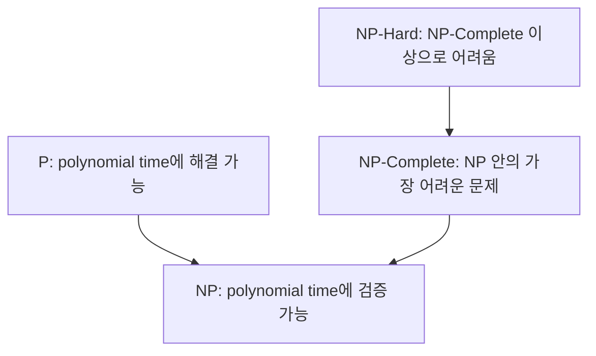

- **원본 노트**: [GitHub](https://github.com/RayKim3103/Undergraduate-Course/blob/main/%5BUndergraduate%5D_Data_Structure/lecture_notes/25%20%EA%B3%84%EC%82%B0%20%EB%82%9C%ED%95%B4%EC%84%B1.md)


## 실용적인 알고리즘의 기준

강의는 “어떤 알고리즘이 실제로 유용한가?”라는 질문에서 시작한다. 보통 모든 입력에 대해 polynomial time에 실행되는 알고리즘을 실용적 기준으로 삼는다.

```text
Polynomial time = O(n^a)
```

반대로 `O(n!)` 같은 비다항 시간은 입력이 조금만 커져도 계산이 불가능해진다. 강의 예시는 `1000!`이 우주의 전자 수, 초당 명령 수, 우주 나이를 모두 곱한 규모보다도 훨씬 커질 수 있음을 보여준다.

## 풀 수 있는 문제와 알고리즘

문제에 대해 알고 싶은 것은 두 가지다.

- 실제로 polynomial-time algorithm이 있는가?
- 없다면 단순히 아직 못 찾은 것인가, 근본적으로 어려운 것인가?

예시:

| 문제 | 설명 | 알려진 polynomial algorithm |
|---|---|---|
| LSOLVE | 선형 방정식 시스템의 해 찾기 | Gaussian elimination `O(n^3)` |
| LP | 선형 부등식 시스템의 해 찾기 | Ellipsoid algorithm 등 |
| ILP | 선형 부등식 시스템의 binary solution 찾기 | 알려진 다항 알고리즘 없음 |

## Search Problem

Search problem은 instance `I`가 주어졌을 때 solution `S`를 찾는 문제다.

중요 조건:

```text
제안된 S가 정말 I의 해인지 polynomial time에 검사할 수 있어야 한다.
```

예:

- LSOLVE: 해를 방정식에 대입해 확인한다.
- LP: 해를 부등식에 대입해 확인한다.
- ILP: binary 조건과 부등식을 확인한다.
- FACTOR: 제안된 factor로 나누어 확인한다.

## NP

NP는 solution을 polynomial time에 검증할 수 있는 문제들의 집합이다.

동치적 설명:

- deterministic Turing machine으로 polynomial time에 검증 가능
- nondeterministic Turing machine으로 polynomial time에 해결 가능

비결정성은 원하는 답을 “맞게 추측”할 수 있는 계산 모델로 이해할 수 있다.

## P

P는 deterministic computation으로 polynomial time에 풀 수 있는 문제들의 집합이다.

관계:

```text
P subset NP
```

P 문제는 답을 찾을 수 있으므로 당연히 검증도 할 수 있다.

## P vs NP

핵심 질문:

```text
P = NP ?
```

즉, polynomial time에 검증할 수 있는 모든 해를 polynomial time에 찾을 수도 있는가?

이는 아직 해결되지 않은 대표적인 이론 컴퓨터과학 문제다.

## Intractable

강의에서는 P에 속하지 않는 search problem을 intractable하다고 부른다. 직관적으로는 모든 입력에 대해 효율적으로 풀 수 있는 알고리즘이 없는 문제다.

## Reduction

Reduction은 문제의 어려움을 비교하는 도구다.

```text
X reduces to Y
```

의미:

- Y를 푸는 subroutine이 있으면 X도 polynomial overhead로 풀 수 있다.
- Y는 적어도 X만큼 어렵다.
- Y에 polynomial algorithm이 있으면 X에도 있다.
- X에 polynomial algorithm이 없으면 Y에도 없다.

## Reduction 예시: LSOLVE to LP

등식 `Ax = b`는 두 부등식으로 바꿀 수 있다.

```text
Ax <= b
Ax >= b
```

따라서 선형 방정식 문제를 선형 부등식 문제로 변환할 수 있고, LSOLVE는 LP로 reduce된다.

## 3-SAT

3-SAT 문제:

```text
k개의 clause와 n개의 boolean variable로 된 CNF formula F가 주어졌을 때,
F를 참으로 만드는 truth assignment를 찾는다.
```

CNF는 clause들의 AND이고, 각 clause는 literal들의 OR이다. 3-SAT에서는 clause마다 3개의 literal을 가진다.

## Cook-Levin 정리

Cook-Levin theorem:

```text
모든 NP 문제는 3-SAT으로 reduce된다.
```

즉 3-SAT은 NP 안에서 가장 어려운 문제 계열의 대표다.

## NP-Complete

NP-complete 문제는 다음을 만족한다.

1. 그 문제는 NP에 속한다.
2. NP의 모든 문제가 그 문제로 reduce된다.

3-SAT은 NP-complete의 대표 예다. 3-SAT을 polynomial time에 풀면 NP의 모든 문제를 polynomial time에 풀 수 있다.

Karp의 21개 NP-complete 문제에는 3-COLOR, VERTEX COVER, EXACT COVER, SUBSET-SUM, PARTITION, KNAPSACK, BIN-PACKING, CLIQUE, HAM-CYCLE, TSP 등이 포함된다.

## NP-Hard

NP-hard는 NP의 가장 어려운 문제들만큼 어렵다는 뜻이다.

중요한 차이:

- NP-complete는 NP에 속해야 한다.
- NP-hard는 반드시 NP에 속할 필요가 없다.

즉 NP-hard 문제는 solution 검증이 polynomial time이라는 조건을 만족하지 않을 수도 있다.

## 문제 분류 지도



## 함께 보면 좋은 노트

- [성능 분석](09-performance-analysis.md)
- [그래프](22-graphs.md)
- [최단 경로](24-shortest-paths.md)

## 보강 학습 노트

### 큰 그림

- 이 문서는 **25. 계산 난해성**를 다루며, C++ 기초와 자료구조/알고리즘을 연결해 데이터를 저장하고 탐색하고 갱신하는 비용을 체계적으로 분석한다.
- 단편적인 정의를 외우기보다 입력이 무엇이고, 내부에서 어떤 변환이 일어나며, 출력이나 성능 지표가 어떻게 결정되는지 흐름으로 잡는 것이 좋다.
- 앞뒤 단원과 연결해 보면 이 주제가 왜 필요한지, 어떤 가정을 추가하거나 완화하는지 더 분명해진다.

### 핵심을 더 깊게 보기

- 자료구조 주제에서는 operation별 복잡도와 구현 invariant를 함께 외워야 실제 코드에서 흔들리지 않는다.
- C++ 구현에서는 값 복사, 참조, 포인터 소유권, 예외 안전성을 코드 리뷰 기준으로 삼는다.
- 자료구조 선택은 기능이 아니라 operation별 시간/공간 복잡도와 access pattern의 선택이다.
- C++에서는 객체 수명, copy/move, pointer/reference, const correctness가 자료구조 안정성을 좌우한다.
- 알고리즘 분석은 Big-O뿐 아니라 input size, worst/average case, hidden constant, memory locality를 함께 본다.

### 문제 풀이 또는 구현 루틴

- 필요한 operation을 insert/delete/search/traverse/update로 나눈 뒤 빈도를 추정한다.
- 구현 전 invariant를 적고, 각 함수가 invariant를 보존하는지 확인한다.
- 복잡도는 loop 중첩, recursion recurrence, data movement 비용을 분리해 계산한다.
- 마지막에는 단위, 차원, boundary condition, edge case를 확인해 계산 결과가 현실적인지 검산한다.

### 자주 하는 실수

- 포인터 소유권을 명확히 하지 않으면 leak, dangling pointer, double delete가 생긴다.
- 평균 O(1)인 hash table도 충돌과 rehash 비용을 고려해야 한다.
- 정렬/그래프 알고리즘은 안정성, 메모리 사용, 입력 조건에 따라 적합성이 달라진다.
- 정의를 그대로 적용하기 전에 이 단원에서 전제한 ideal assumption이 실제 문제에서도 유지되는지 확인한다.

### 스스로 점검할 질문

- 이 자료구조가 유지해야 하는 invariant는 무엇인가?
- 가장 자주 호출되는 operation의 복잡도는 무엇인가?
- 구현이 edge case인 empty, one element, duplicate, overflow를 처리하는가?
- **25. 계산 난해성**를 한 문장으로 설명하고, 관련 수식이나 회로/알고리즘/시스템 그림 없이도 핵심 흐름을 말할 수 있는가?



---

이전: [24. 최단 경로](24-shortest-paths.md)
